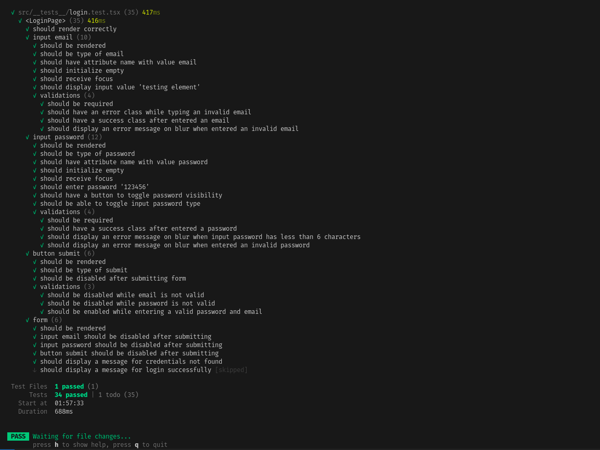
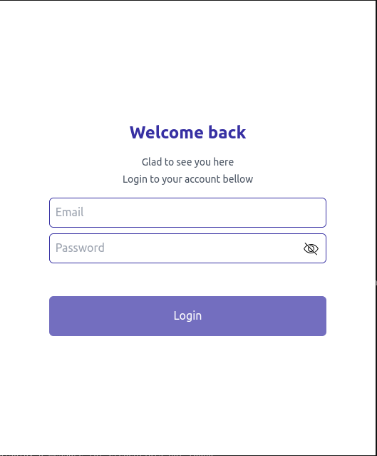
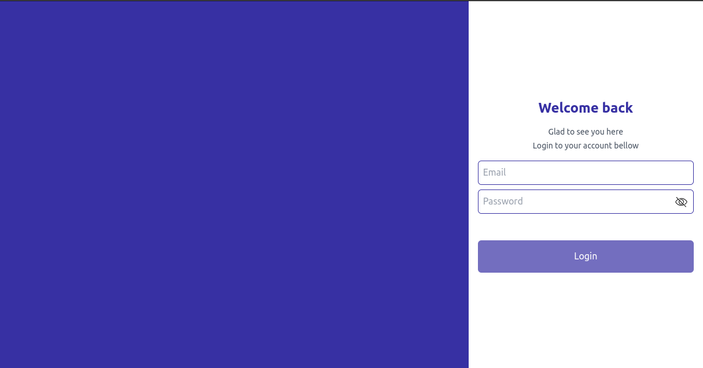

# React TDD Project

This is a simple project that applies Test-Driven Development (TDD) using React. The project is structured to demonstrate the principles of TDD and how to implement it effectively with React and related tools.

## Technologies Used

- **React (Version 18)**
- **TypeScript**
- **Vite**
- **Testing Library/React**
- **Bun**
- **MDI Light**
- **Tailwindcss**

## Getting Started

### Prerequisites

To run this project, you need to have **Bun** installed on your machine. If you don't have Bun installed, you can install it by following the instructions on the [Bun website](https://bun.sh/).

Alternatively, you can use **Yarn** or **npm** to run the project.

### Installation

1 - **Clone the repository:**

```bash
git clone https://github.com/yourusername/react-tdd-project.git
cd react-tdd-project
```

2 - **Install dependencies:**

Using bun

```bash
bun install
```

Using yarn
  
  ```bash
  yarn
  ```

Using npm
  
```bash
npm install
```

3 - **Running Tests:**

Using bun

```bash
bun run test
```

Using yarn
  
```bash
yarn test
```

Using npm

```bash
npm run test
```

## Project Status

This project is currently in progress. New features and additional screens will be added in the future.

## License

[MIT](https://choosealicense.com/licenses/mit/)

## Screenshots




